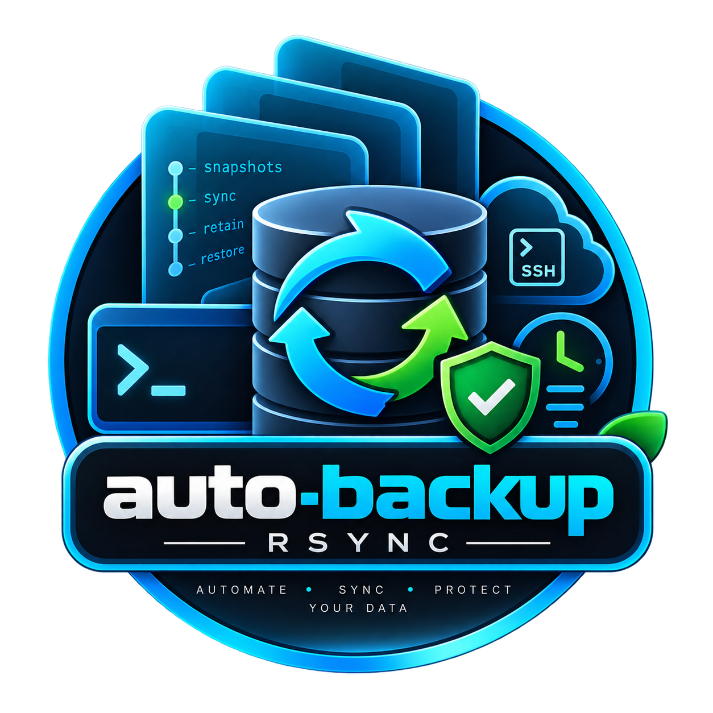

<p align="center"></p>

# auto-backup

Automated, resumable Linux and macOS backups with rsync, systemd timers, and launchd agents.

## Features

- **Resumable transfers** — `--partial` + `--partial-dir` lets rsync resume interrupted backups from where they left off. On GNU rsync, `--append-verify` adds checksum-based verification for appended data.
- **Hard-linked snapshots** — `--link-dest` against the previous snapshot means unchanged files cost zero extra space. Backups are fast and storage-efficient.
- **Retention policy** — keep-newest-per-bucket: daily, weekly, and monthly. Fully deterministic, no GNU date dependency.
- **Feature detection** — every rsync flag is checked against `rsync --help` at runtime. Works with both GNU rsync and Apple's openrsync. Install GNU rsync (`brew install rsync`) for full dedup and resume support on macOS.
- **Portable locking** — `mkdir`-based lock directories (no `flock` dependency). Works on Linux and macOS.
- **Remote destinations** — back up to `user@host:/path` over SSH. Pruning executes over the same SSH channel.
- **Hooks and notifications** — run pre/post commands, send alerts via ntfy, email, or webhook on failure.
- **Systemd + launchd** — install systemd timers (Linux) or launchd agents (macOS) automatically, or schedule via cron.

## Requirements

- `rsync` (GNU or openrsync)
- `bash` 3.2+
- `ssh` (for remote destinations only)
- `shellcheck` (optional, for linting)

## Installation

### Prerequisites

| Dependency | Linux | macOS | Notes |
|------------|-------|-------|-------|
| `rsync` | `sudo apt install rsync` or `sudo dnf install rsync` | Ships with macOS (openrsync). For full support: `brew install rsync` | GNU rsync enables `--append-verify` for verified resume |
| `bash` 3.2+ | Ships | Ships | Used as the shell for all scripts |
| `ssh` | Ships | Ships | Required for remote destinations only |
| `shellcheck` | `sudo apt install shellcheck` | `brew install shellcheck` | Optional, for linting |

### Option 1: Install script (recommended)

The installer handles binaries, config dirs, and scheduler registration on both Linux and macOS.

```bash
git clone https://github.com/ritchegerona/auto-backup-rsync.git
cd auto-backup-rsync

# System-wide install (requires root on Linux for systemd)
sudo ./install/install.sh

# Or per-user install (no root needed)
./install/install.sh

# Custom prefix (e.g. Homebrew on Apple Silicon)
./install/install.sh --prefix /opt/homebrew

# Skip scheduler setup (manual cron/systemd later)
./install/install.sh --no-scheduler

# Preview without changes
./install/install.sh --dry-run
```

**What the installer does:**
- Copies `auto-backup` and `backup-lib.sh` to `$PREFIX/bin/` (default: `/usr/local/bin`)
- Creates config at `/etc/auto-backup/` (root) or `~/.config/auto-backup/` (user)
- Copies sample job configs to `jobs.d/` (never overwrites existing)
- Creates runtime dirs at `/var/log/auto-backup/` or `~/Library/Logs/auto-backup/`
- Registers scheduler: systemd timers (Linux root), launchd agents (macOS), or prints cron hint

### Option 2: Manual install

```bash
git clone https://github.com/ritchegerona/auto-backup-rsync.git
cd auto-backup-rsync

# Copy binaries
sudo install -m 755 bin/backup.sh /usr/local/bin/auto-backup
sudo install -m 755 bin/backup-lib.sh /usr/local/bin/backup-lib.sh

# Create config structure
sudo mkdir -p /etc/auto-backup/jobs.d
sudo cp etc/backup.conf /etc/auto-backup/
sudo cp etc/jobs.d/*.conf /etc/auto-backup/jobs.d/

# Create runtime dirs
sudo mkdir -p /var/log/auto-backup/{locks,state}

# Edit a job
sudo vim /etc/auto-backup/jobs.d/myjob.conf
```

### Option 3: Per-user (no root)

```bash
git clone https://github.com/ritchegerona/auto-backup-rsync.git
cd auto-backup-rsync

# Create dirs
mkdir -p ~/.config/auto-backup/jobs.d
mkdir -p ~/bin

# Copy files
cp bin/backup.sh ~/bin/auto-backup
cp bin/backup-lib.sh ~/bin/backup-lib.sh
cp etc/backup.conf ~/.config/auto-backup/
cp etc/jobs.d/*.conf ~/.config/auto-backup/jobs.d/

# Add to PATH (if not already)
echo 'export PATH="$HOME/bin:$PATH"' >> ~/.zshrc   # or ~/.bashrc
source ~/.zshrc

# Scaffold runtime dirs
auto-backup init
```

### Post-installation verification

```bash
# Confirm installation
auto-backup version

# List available jobs
auto-backup list

# Validate a job (tests sources, destination, SSH connectivity)
auto-backup check myjob

# Dry-run (simulates backup without changes)
auto-backup run myjob --dry-run

# First real run
auto-backup run myjob

# Check status
auto-backup status myjob

# View logs
tail -f /var/log/auto-backup/auto-backup.log
```

### Set up scheduling

```bash
# Linux (systemd) — enable timer for a job
sudo systemctl enable --now auto-backup@myjob.timer
systemctl list-timers | grep auto-backup

# macOS (launchd) — loaded automatically by install.sh
# Verify:
launchctl list | grep auto-backup

# Manual cron entry (both platforms)
crontab -e
# Add: 0 3 * * * /usr/local/bin/auto-backup run all
```

### Uninstall

```bash
# Remove binaries, keep config and logs
sudo ./install/uninstall.sh

# Remove everything (binaries, config, logs, scheduled entries)
sudo ./install/uninstall.sh --purge

# Preview without changes
./install/uninstall.sh --dry-run
```

## Configuration

### Global defaults (`/etc/auto-backup/backup.conf`)

```bash
RETENTION_DAILY=7       # keep newest snapshot per day for 7 days
RETENTION_WEEKLY=4      # keep newest per week for 4 weeks
RETENTION_MONTHLY=6     # keep newest per month for 6 months
USE_DELETE=0            # 1 = mirror source deletions into snapshots
USE_CHECKSUM=0          # 1 = force checksum comparison (slower)
```

### Job configs (`/etc/auto-backup/jobs.d/<name>.conf`)

Each file defines one backup job. Sourced as bash.

| Key | Required | Description |
|-----|----------|-------------|
| `SOURCE` | yes* | Single source path |
| `SOURCES` | yes* | Array of source paths (alternative to `SOURCE`) |
| `DEST` | yes | Destination. Local: `/mnt/backup`. Remote: `user@host:/backups` |
| `EXCLUDES` | no | Array of rsync exclude patterns |
| `EXCLUDE_FILES` | no | Array of paths to `--exclude-from` files |
| `USE_DELETE` | no | Override `USE_DELETE` per job |
| `USE_CHECKSUM` | no | Override `USE_CHECKSUM` per job |
| `RSYNC_OPTIONS` | no | Array of extra rsync flags |
| `HOOK_PRE` | no | Array of commands to run before backup |
| `HOOK_POST` | no | Array of commands to run after successful backup |
| `ON_FAILURE` | no | Array of commands to run on failure |

\* Either `SOURCE` or `SOURCES` must be set.

### Example: local job

```bash
SOURCE="$HOME/Documents"
DEST=/Volumes/Backup/personal
EXCLUDES=(".DS_Store" "node_modules" "Library/Caches")
```

### Example: remote job

```bash
SOURCE=/srv/www
DEST=backup@backup.example.com:/backups/www
EXCLUDES=("*" "*.log" "cache/")
ON_FAILURE=("curl -fsS -m 10 -H 'Title: backup failed' -d 'job www failed' ntfy.sh/YOUR-TOPIC")
```

## How It Works

### Snapshot layout

```
DEST/
├── current -> snapshots/backup-20260906-120000
└── snapshots/
    ├── backup-20260906-120000/    ← newest
    ├── backup-20260905-120000/
    └── backup-20260901-120000/
```

`current` is a symlink at the destination root pointing to the newest snapshot. rsync's `--link-dest` hard-links unchanged files against the previous snapshot, so only changed data consumes new space.

### Resumability

If a transfer is interrupted, rsync's `--partial-dir=.rsync-partial` preserves partially transferred data. On the next run, rsync resumes from where it left off. On GNU rsync (including Homebrew's), `--append-verify` verifies file integrity during resume.

### Retention

`auto-backup prune <job>` applies keep-newest-per-bucket retention:

1. Walk snapshots newest-to-oldest
2. For each distinct day (up to `RETENTION_DAILY`): keep the newest snapshot
3. For each distinct ISO week (up to `RETENTION_WEEKLY`): keep the newest snapshot
4. For each distinct month (up to `RETENTION_MONTHLY`): keep the newest snapshot
5. Delete everything else

```bash
# Show what would be pruned
auto-backup prune myjob --dry-run

# Actually prune
auto-backup prune myjob
```

Pruning runs automatically after each successful backup.

## Scheduling

### systemd (Linux, root required)

```bash
# Install timer (done by install.sh for each job in jobs.d/)
systemctl enable --now auto-backup@myjob.timer

# Check status
systemctl status auto-backup@myjob.timer
systemctl list-timers --all | grep auto-backup

# Run manually
systemctl start auto-backup@myjob.service
```

### launchd (macOS)

```bash
# Install (done by install.sh)
# Plists installed to:
#   root: /Library/LaunchDaemons/com.autobackup.<job>.plist
#   user: ~/Library/LaunchAgents/local.com.autobackup.<job>.plist

# Manual load
launchctl load /Library/LaunchDaemons/com.autobackup.myjob.plist
launchctl list | grep auto-backup
```

### Cron fallback

```bash
# /etc/crontab (system-wide, randomized minute)
3 3 * * * root /usr/local/bin/auto-backup run all
```

## Remote Backups

Remote destinations use rsync over SSH. Pruning executes over the same SSH channel to delete old snapshots on the remote host.

**Requirements:**
- Passwordless SSH key authentication
- SSH host key already in `known_hosts`

```bash
# Test connectivity
auto-backup check remotejob

# Dry-run
auto-backup run remotejob --dry-run
```

## Notifications and Hooks

```bash
# In job config:
HOOK_PRE=("systemd-notify --status='backup starting'")
HOOK_POST=("systemd-notify --status='backup complete'")
ON_FAILURE=(
  "curl -fsS -m 10 -H 'Title: backup failed' -d 'job %j failed at $(date)' ntfy.sh/YOUR-TOPIC"
  "mail -s 'auto-backup failed' root@localhost <<< 'Job failed'"
)
```

## Troubleshooting

- **Stale lock**: If a backup was interrupted, the lock file may persist. Remove it: `rm -rf /var/log/auto-backup/locks/job-<name>`
- **openrsync limitations**: Apple's openrsync lacks `--append-verify`. Install GNU rsync for full support: `brew install rsync`
- **Shellcheck**: Run `shellcheck bin/*.sh` to lint. Config variables are suppressed via `.shellcheckrc`.
- **Verbose output**: Remove `-q` from the CLI or set `AB_QUIET=0` to see log output on stdout.
- **Debugging**: Check `/var/log/auto-backup/auto-backup.log` and `auto-backup status <job>` for last-run details.

## License

MIT